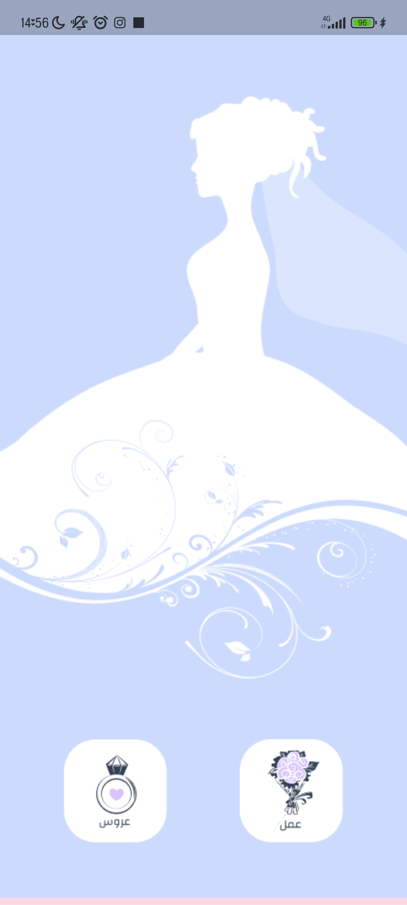
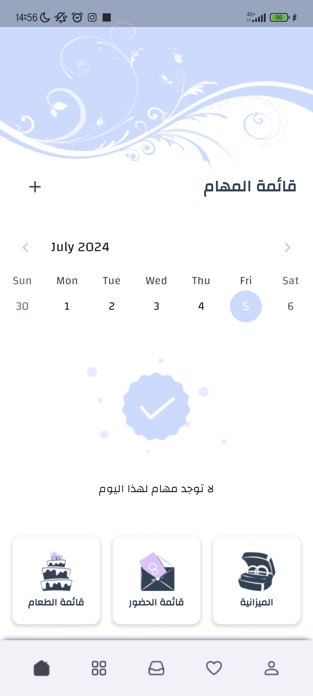

# Wedding Planner and Management Mobile Application Project

Welcome to 3arouss mobile application! This app is designed to help couples plan their perfect wedding with ease and convenience. Built using Flutter, the app offers a comprehensive set of features to manage wedding tasks, guest lists, budgets, and more. Additionally, it includes an integrated shop for all wedding-related purchases.

## Features

- **Task Management**: Create and track wedding planning tasks to ensure everything is on schedule.
- **Guest List Management**: Manage your guest list, send invitations, and track RSVPs all in one place.
- **Budget Tracker**: Keep track of your wedding expenses and manage your budget efficiently.
- **Food List Management**: Manage your food list, and track the menu all in one place.
- **Integrated Shop**: Browse and purchase wedding essentials using the app.
- **Vendor Management**: Find vendors for your wedding needs, from venues to florists.
- **Reminders and Notifications**: Set reminders for important dates and receive notifications to stay on top of your planning.
- **User-friendly Interface**: Enjoy a smooth and intuitive user experience with Flutter’s beautiful and responsive design.

## Mockups

<p align="center">
  
  
</p>

## Screenshots

<p align="center">
  
  
  
  
  
</p>

## Installation

To run this project, ensure you have Flutter installed. Clone the repository and run the following commands:

```bash
flutter pub get
flutter run
```

## Contributing

We welcome contributions to enhance the Wedding Planner app! If you have suggestions, bug reports, or pull requests, please follow these steps:

1. Fork the repository.
2. Create a new branch (`git checkout -b feature-branch`).
3. Make your changes.
4. Commit your changes (`git commit -m 'Add some feature'`).
5. Push to the branch (`git push origin feature-branch`).
6. Open a pull request.

Please ensure your code follows the project's coding standards and includes appropriate tests.


## Contributors

We would like to thank the following people who have contributed to this project:

- **Farez Samah Ikram** - Project Leader, UI/UX Designer & Full Stack Developer
- **Nihal Hocine** - Full Stack Developer, QA Tester & Content Writer
  
Your contributions are greatly appreciated! If you'd like to join us, feel free to reach out or make a pull request.

## License

This project is licensed under the MIT License. See the [LICENSE](LICENSE) file for more details.
